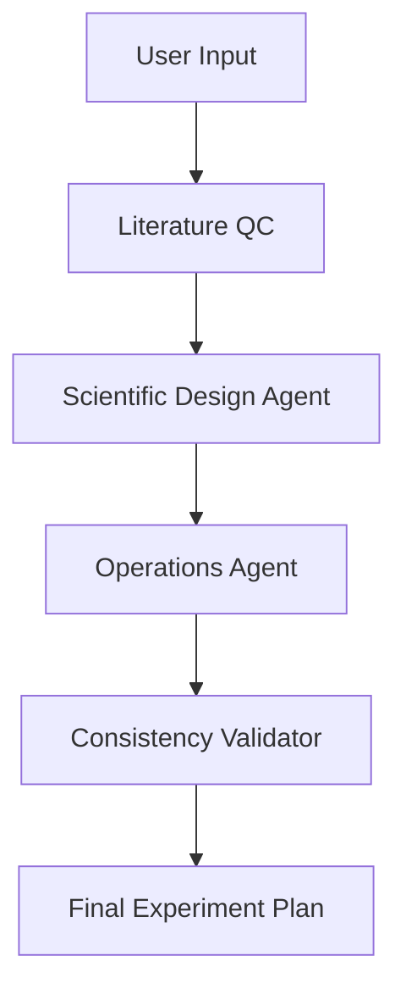

# 🧬 Scientific OS: The AI Scientist
**From hypothesis → literature grounding → runnable experiment plan**

## 🚀 Overview

Designing a scientifically valid, operational experiment typically takes days to weeks of manual work:
- Reviewing literature
- Designing protocols
- Sourcing reagents
- Estimating costs and timelines

**Scientific OS** compresses this into seconds using a multi-agent AI pipeline that produces:
- Literature-aware experiment plans
- Step-by-step protocols
- Reagent lists with realistic pricing
- Execution timelines and operational constraints

The entire system is designed to answer a single question: **"Would a scientist trust this enough to run it?"**

---

## 🧠 Core Capabilities

### 1. Hypothesis → Structured Input
Users submit hypotheses in natural language.
> *"Can replacing sucrose with trehalose improve post-thaw viability of HeLa cells?"*

### 2. Literature Quality Control (QC)
Before generating anything, the system evaluates existing research.
- **Novelty signal:** `not_found`, `similar_work_exists`, `exact_match`
- **Reference grounding:** Surfaces relevant papers and informs downstream reasoning.
👉 *Prevents redundant or already-solved experiments.*

### 3. Scientific Experiment Design (Agent 1)
Generates a lab-grade experimental plan grounded in standards from **protocols.io**, **Bio-Protocol**, and **Thermo Fisher/Sigma-Aldrich** application notes.
- Structured scientific rationale
- Hypothesis-driven endpoints
- Controls and replicates
- Detailed protocol (multi-phase, step-level)
- QC checkpoints and failure modes

### 4. Operational Planning (Agent 2)
Transforms the scientific plan into something runnable.
- Reagents with catalog numbers
- Consumables and equipment usage
- Realistic unit pricing
- Execution timeline (day-by-day tasks)
- Labor estimates

### 5. Consistency & Validation (Agent 3)
Ensures the plan is internally coherent.
- Aligns protocol ↔ materials ↔ timeline
- Detects missing dependencies
- Flags unrealistic assumptions
- Enforces feasibility constraints

### 6. Scientist Feedback Loop (Memory Layer)
Every user correction is stored and reused.
- Structured feedback (category, type, context)
- Linked to protocol steps/entities
- Filtered and injected into future generations
👉 *The system improves over time based on real scientific input.*

---

## 🏗️ System Architecture



## 💻 Tech Stack

| Layer | Technology |
|---|---|
| **Frontend** | Vite + React (Vercel) |
| **Backend** | FastAPI (Python, Railway) |
| **Database** | Supabase (PostgreSQL + JSONB) |
| **AI Models** | GPT-5.5 / GPT-5.4-mini |
| **Security** | Shared-secret handshake + Vercel protection |

---

## 📂 Project Structure

```text
├── main.py                 # FastAPI entrypoint
├── requirements.txt
├── /backend
│   ├── pipeline.py         # Multi-agent orchestration
│   ├── qc.py               # Literature QC
│   ├── database.py         # Supabase + feedback memory
│
├── /frontend
│   ├── src/                # React UI
│   └── .env.production
│
└── README.md
```

---

## ⚙️ Local Setup

### Backend
1. Install dependencies:
   ```bash
   pip install -r requirements.txt
   ```
2. Set environment variables:
   ```env
   SUPABASE_URL=...
   SUPABASE_KEY=...
   UI_BACKEND_SECRET=...
   OPENAI_API_KEY=...
   ```
3. Run the server:
   ```bash
   uvicorn main:app --reload
   ```

### Frontend
1. Navigate to the frontend directory and install dependencies:
   ```bash
   cd frontend
   npm install
   ```
2. Set environment variables:
   ```env
   VITE_API_URL=http://localhost:8000
   VITE_UI_BACKEND_SECRET=your_secret
   ```
3. Run the development server:
   ```bash
   npm run dev
   ```

---

## 🔐 Security
- **Frontend protection (Vercel):** Limits access to authorized users.
- **Backend authentication:** Requests require a shared secret header (`X-Shared-Secret: <token>`). This prevents unauthorized API usage and LLM abuse.

---

## 🧪 Design Principles
- **Grounded in literature** → avoids hallucinated science
- **Operationally realistic** → plans can actually be executed
- **Scientist-in-the-loop** → improves with expert feedback
- **Structured outputs** → machine-readable, composable

## 🎯 What This Is (and Isn’t)
✅ **This is:** A scientific planning engine, a decision-support tool, and a protocol + operations generator.  
❌ **This is not:** A replacement for experimental validation, a source of novel biological claims without evidence, or a tool for unsafe/regulated biological work.

---

## 🧬 Why It Matters

Most AI tools stop at generating ideas. **Scientific OS goes further:** it validates against existing research, designs experiments, and makes them operationally actionable. 

And critically: **It learns from scientists.** Each correction improves the system, turning it from a static generator into a compounding scientific reasoning layer.

> **📌 Guiding Question:** *Would a scientist trust this enough to order the materials and run the experiment?* That is the bar.

---

## 📬 Future Work
- [ ] Automated literature retrieval (live APIs)
- [ ] Experiment ranking / prioritization
- [ ] Deeper cost modeling
- [ ] Lab-specific customization
